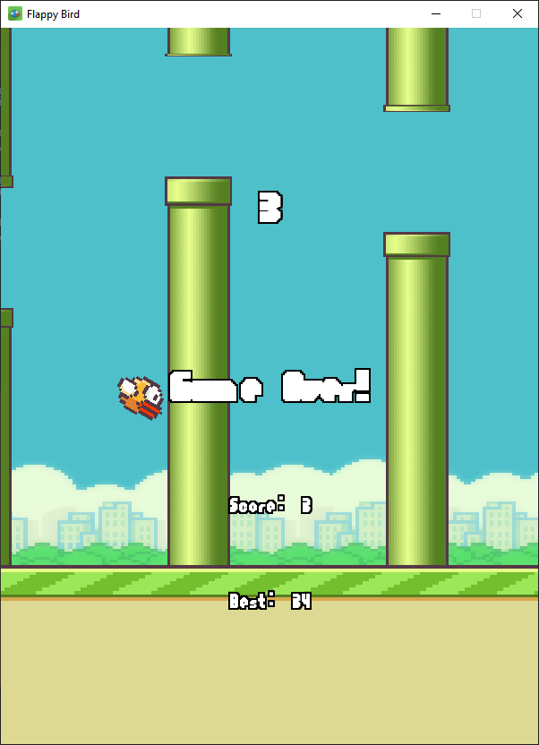

# Flappy Bird

Flappy bird clone written in Python with Pygame. I write everything here all by myself, no watching tutorials, no nothing. Except for some that might require the help of an LLVM.

## Copyright Notice

I didn't own any of the assets; Flappy Bird is Dong Nguyen's creation, all rights reserved to him. Though, this repo is under the MIT License for ease of reuse.

Assets used in this game can be obtained [here](https://github.com/samuelcust/flappy-bird-assets).
